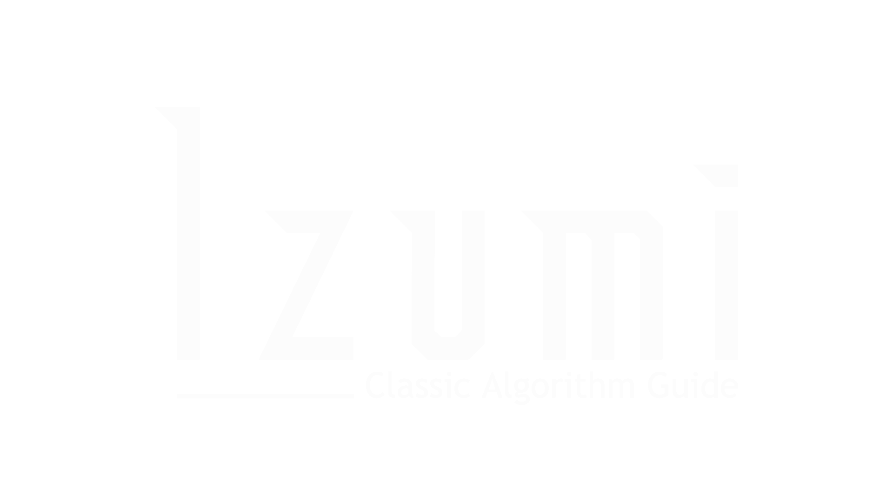

<!-- PROJECT SHIELDS -->
[![Contributors][contributors-shield]][contributors-url]
[![Forks][forks-shield]][forks-url]
[![Stargazers][stars-shield]][stars-url]
[![Issues][issues-shield]][issues-url]
[![MIT License][license-shield]][license-url]

<!-- PROJECT LOGO -->
 
  

  <h3 align="center">Izumi - Now in C++</h3>

  

  

    Teaching you algorithms which you'll never forget - nor spell correctly, including Collatz's Conjecture, Fibonacci and Sieve of Eratosthenes.
     
    <a href="https://github.com/John-JonSteyn/Izumi_ClassicAlgorithmGuide/"><strong>View Source Code »</strong></a>
     
     
    <a href="https://github.com/John-JonSteyn/Izumi_ClassicAlgorithmGuide/issues">Report Bug</a>
    ·
    <a href="https://github.com/John-JonSteyn/Izumi_ClassicAlgorithmGuide/issues">Request Feature</a>
  

<!-- TABLE OF CONTENTS -->

  
Table of Contents

  <ol>
    <li>
      <a href="#about-the-project">About The Project</a>
      <ul>
        <li><a href="#built-with">Built With</a></li>
      </ul>
    </li>
    <li><a href="#preview">Preview of Izumi</a></li>
    <li><a href="#roadmap">Roadmap</a></li>
    <li><a href="#contributing">Contributing</a></li>
    <li><a href="#license">License</a></li>
    <li><a href="#acknowledgments">Acknowledgments</a></li>
  </ol>

<!-- ABOUT THE PROJECT -->
## About The Project

Izumi is here to teach you about the fucntionality of classical algorithms, and - being Open Source - you can also inspect her code to see how those algorithms are translated into C++.

Current Algorithms:
* Bubble Sorting
* Collatz's Conjecture
* Fibonacci Sequence
* Sieve of Eratosthenes

(<a href="#top">back to top</a>)

### Built With

* [C++](https://www.geeksforgeeks.org/c-programming-basics/)

(<a href="#top">back to top</a>)

<!-- Preview -->
## Preview

Izumi is meant to make the user feel as comfortable as possible, which lead to the decision of creating a persona for the program.
  
)
  
Izumi aims to minimise the user's need to supply input unnecessary to the explanation of an algorithm, and as such all algorithms are explained sequentially without the user's need for their selection.
  

  
Izumi also sements each algorithm into bite-sized explanations, waiting for the user to press a key before continuing - making the learning program as long as necessary or only as short as needed for each individual user.
  

(<a href="#top">back to top</a>)

<!-- ROADMAP -->
## Roadmap

- [x] Collatz's Conjecture
- [x] Fibonacci Sequence
- [x] Sieve of Eratosthenes
- [x] Sort: Bubble
- [ ] e ^ n
- [ ] Sort: Merge
- [ ] Multi-language Support
    - [ ] Deutsch
    - [ ] Français
    - [ ] Português

See the [open issues](https://github.com/John-JonSteyn/Izumi_ClassicAlgorithmGuide/issues) for a full list of proposed features (and known issues).

(<a href="#top">back to top</a>)

<!-- CONTRIBUTING -->
## Contributing

Contributions are what make the open source community such an amazing place to learn, inspire, and create. Any contributions you make are **greatly appreciated**.

If you have a suggestion that would make this better, please fork the repo and create a pull request. You can also simply open an issue with the tag "enhancement".
Don't forget to give the project a star! Thanks again!

1. Fork the Project
2. Create your Feature Branch (`git checkout -b feature/AmazingFeature`)
3. Commit your Changes (`git commit -m 'Add some AmazingFeature'`)
4. Push to the Branch (`git push origin feature/AmazingFeature`)
5. Open a Pull Request

(<a href="#top">back to top</a>)

<!-- LICENSE -->
## License

Distributed under the MIT License. See `LICENSE.txt` for more information.

(<a href="#top">back to top</a>)

<!-- ACKNOWLEDGMENTS -->
## Acknowledgments

I'd like to acknowledge Karan and his project list, which greatly inspired not only this project - but many projects to come.
* [Karan Projects](https://github.com/karan/Projects)

(<a href="#top">back to top</a>)

<!-- MARKDOWN LINKS & IMAGES -->
[contributors-shield]: https://img.shields.io/github/contributors/John-JonSteyn/Izumi_ClassicAlgorithmGuide.svg?style=for-the-badge
[contributors-url]: https://github.com/John-JonSteyn/Izumi_ClassicAlgorithmGuide/graphs/contributors
[forks-shield]: https://img.shields.io/github/forks/John-JonSteyn/Izumi_ClassicAlgorithmGuide.svg?style=for-the-badge
[forks-url]: https://github.com/John-JonSteyn/Izumi_ClassicAlgorithmGuide/network/members
[stars-shield]: https://img.shields.io/github/stars/John-JonSteyn/Izumi_ClassicAlgorithmGuide.svg?style=for-the-badge
[stars-url]: https://github.com/John-JonSteyn/Izumi_ClassicAlgorithmGuide/stargazers
[issues-shield]: https://img.shields.io/github/issues/John-JonSteyn/Izumi_ClassicAlgorithmGuide.svg?style=for-the-badge
[issues-url]: https://github.com/John-JonSteyn/Izumi_ClassicAlgorithmGuide/issues
[license-shield]: https://img.shields.io/github/license/John-JonSteyn/Izumi_ClassicAlgorithmGuide.svg?style=for-the-badge
[license-url]: https://github.com/John-JonSteyn/Izumi_ClassicAlgorithmGuide/blob/master/LICENSE.txt

